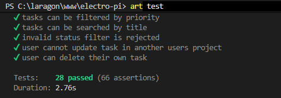

# Task Management System API

RESTful API for a simple Task Management System, built for the ElectroPi Laravel Mid-Level Technical Assessment.

Each user manages their own **Projects**, and each Project contains multiple **Tasks**. Authentication is token-based via Laravel Sanctum.

---

## Tech Stack

- Laravel 13 (PHP 8.3+)
- MySQL
- Laravel Sanctum (API authentication)
- PHPUnit (Feature tests)
- Larastan (static analysis)

---

## Installation Steps

```bash
# 1. Clone the repository
git clone <your-repo-url> task-management-api
cd task-management-api

# 2. Install dependencies
composer install

# 3. Copy the environment file
cp .env.example .env

# 4. Generate the application key
php artisan key:generate

# 5. Configure your database in .env (see Environment Setup below),
#    then run migrations with the seeder
php artisan migrate --seed

# 6. Serve the application
php artisan serve
```

The API will be available at `http://localhost:8000/api`.

---

## Environment Setup

Set the following in your `.env` file:

```env
APP_NAME="Task Management API"
APP_ENV=local
APP_DEBUG=true
APP_URL=http://localhost:8000

DB_CONNECTION=mysql
DB_HOST=127.0.0.1
DB_PORT=3306
DB_DATABASE=task_management
DB_USERNAME=root
DB_PASSWORD=
```

### Demo credentials (created by the seeder)

| Email | Password |
|---|---|
| `demo@example.com` | `password` |
| `other@example.com` | `password` (a second account, used to prove data isolation between users) |

### Running tests

Tests run against SQLite in-memory by default. Confirm `phpunit.xml` contains:

```xml
<env name="DB_CONNECTION" value="sqlite"/>
<env name="DB_DATABASE" value=":memory:"/>
```

Then run:

```bash
php artisan test
```

---

Tests Results


## Authentication

All endpoints except `Register` and `Login` require a Sanctum bearer token:

```
Authorization: Bearer {token}
```

| Method | Endpoint | Description |
|---|---|---|
| POST | `/api/register` | Create an account, returns a token |
| POST | `/api/login` | Log in, returns a token |
| POST | `/api/logout` | Revoke the current token (requires auth) |

**Register — request body**
```json
{
  "name": "Omar Ashraf",
  "email": "omar@example.com",
  "password": "password123",
  "password_confirmation": "password123"
}
```

**Login — request body**
```json
{
  "email": "demo@example.com",
  "password": "password"
}
```

**Response (Register/Login) — 201 / 200**
```json
{
  "user": { "id": 1, "name": "Omar Ashraf", "email": "omar@example.com", "created_at": "..." },
  "token": "1|xxxxxxxxxxxxxxxxxxxxxxxx"
}
```

---

## Projects

Every project belongs to the authenticated user. Users can never see, update, or delete another user's project (enforced by `ProjectPolicy`).

| Method | Endpoint | Description |
|---|---|---|
| GET | `/api/projects` | List the authenticated user's projects (paginated) |
| POST | `/api/projects` | Create a project |
| GET | `/api/projects/{project}` | View a single project |
| PUT/PATCH | `/api/projects/{project}` | Update a project |
| DELETE | `/api/projects/{project}` | Soft-delete a project (cascades to its tasks) |

**Create/Update — request body**
```json
{
  "name": "LMS Platform",
  "description": "Backend for the LMS portfolio project",
  "status": "active"
}
```
`status` accepts: `active`, `completed`, `archived`.

**Response — single project**
```json
{
  "data": {
    "id": 1,
    "name": "LMS Platform",
    "description": "Backend for the LMS portfolio project",
    "status": "active",
    "tasks_count": 8,
    "created_at": "...",
    "updated_at": "..."
  }
}
```

---

## Tasks

Tasks are nested under a project for listing/creating, and addressed directly by id for viewing/updating/deleting. Ownership is checked through the parent project (`TaskPolicy`).

| Method | Endpoint | Description |
|---|---|---|
| GET | `/api/projects/{project}/tasks` | List tasks in a project (paginated, filterable) |
| POST | `/api/projects/{project}/tasks` | Create a task in a project |
| GET | `/api/tasks/{task}` | View a single task |
| PUT/PATCH | `/api/tasks/{task}` | Update a task |
| DELETE | `/api/tasks/{task}` | Soft-delete a task |

**Query filters on the list endpoint**

| Param | Example | Description |
|---|---|---|
| `status` | `?status=todo` | `todo`, `in_progress`, or `done` |
| `priority` | `?priority=high` | `low`, `medium`, or `high` |
| `search` | `?search=schema` | Partial match on task title |
| `per_page` | `?per_page=20` | Pagination size (max 100) |

**Create/Update — request body**
```json
{
  "title": "Design database schema",
  "description": "Draft the ERD for projects/tasks",
  "priority": "high",
  "status": "todo",
  "due_date": "2026-08-10"
}
```

**Response — single task**
```json
{
  "data": {
    "id": 1,
    "project_id": 1,
    "title": "Design database schema",
    "description": "Draft the ERD for projects/tasks",
    "priority": "high",
    "status": "todo",
    "due_date": "2026-08-10",
    "is_overdue": false,
    "created_at": "...",
    "updated_at": "..."
  }
}
```

---

## Dashboard

| Method | Endpoint | Description |
|---|---|---|
| GET | `/api/dashboard` | Aggregate stats for the authenticated user |

**Response**
```json
{
  "total_projects": 5,
  "active_projects": 3,
  "total_tasks": 40,
  "completed_tasks": 12,
  "pending_tasks": 28,
  "overdue_tasks": 4
}
```

- `pending_tasks` = tasks with status `todo` or `in_progress`.
- `overdue_tasks` = pending tasks whose `due_date` is in the past.

---

## Error Responses

All errors return JSON with an appropriate HTTP status code:

| Status | Meaning |
|---|---|
| 401 | Missing/invalid/revoked token |
| 403 | Authenticated, but not the owner of this resource |
| 404 | Resource not found |
| 422 | Validation failed (body includes an `errors` object per field) |
| 500 | Unexpected server error (no stack trace leaked) |

---

## Postman Collection

Import `Task-Management-API.postman_collection.json`. The **Login** request auto-saves the token, and **Create Project** / **Create Task** auto-save their ids into collection variables — so the whole flow can be run top-to-bottom with no manual copy-pasting. Update the `base_url` variable if you're not running on `localhost:8000`.

---

## Running with Docker

```bash
# 1. Copy and configure your .env (DB_HOST must be "mysql", matching the compose service name)
cp .env.example .env

# 2. Build and start everything: nginx, php-fpm, mysql, a queue worker, and a scheduler tick
docker compose up -d --build

# 3. Install dependencies (skipped in dev if you mount the volume before building)
docker compose exec app composer install

# 4. Generate the app key, migrate, and seed
docker compose exec app php artisan key:generate
docker compose exec app php artisan migrate --seed
```

The API is then available at `http://localhost:8000/api`.

**Services:**
| Service | Purpose |
|---|---|
| `nginx` | Web server, exposed on port 8000 |
| `app` | PHP-FPM, runs the actual Laravel code |
| `mysql` | Database, exposed on port 3306 |
| `queue` | Runs `php artisan queue:work` — required for `TaskOverdueNotification` to actually send |
| `scheduler` | Ticks `php artisan schedule:run` every minute — required for `tasks:check-overdue` to fire daily |

To watch logs for a specific service (e.g. to see queued notifications firing):
```bash
docker compose logs -f queue
```

To run the test suite inside the container:
```bash
docker compose exec app php artisan test
```

---

## Design Notes

- **Enums** (`ProjectStatus`, `TaskStatus`, `TaskPriority`) back the status/priority columns instead of magic strings, cast automatically by Eloquent.
- **Policies** (`ProjectPolicy`, `TaskPolicy`) centralize ownership checks; task ownership is derived through its parent project since tasks have no direct `user_id`.
- **Form Requests** handle both validation and authorization (`authorize()` delegates to the relevant Policy), keeping controllers thin.
- **`ProjectObserver`** cascades soft-deletes (and restores) from a project to its tasks, since a native DB `cascadeOnDelete` only fires on a hard delete, not a soft one.
- **`DashboardService`** isolates the stats aggregation (2 raw-aggregate queries instead of 6 separate counts) so it's testable independently of the HTTP layer.
- Centralized JSON exception handling in `bootstrap/app.php` ensures every error — validation, auth, authorization, not-found, or unexpected — comes back as consistent JSON with the right status code.
